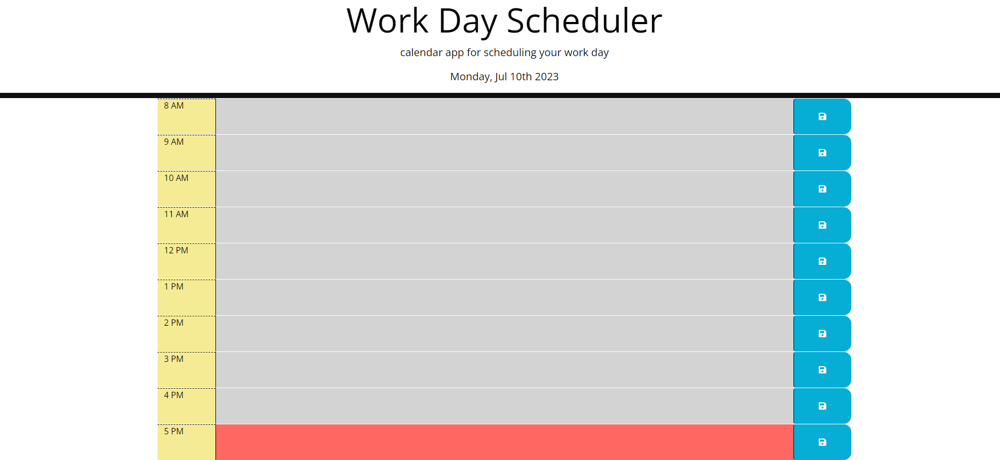

# Workday Scheduler

## Homework Description
Created a simple calendar application that allows a user to save events for each hour of a typical working day (9am–5pm). This app will run in the browser and feature dynamically updated HTML and CSS powered by jQuery.

The starter code uses the Day.js. library to work with date and time, but feel free to use a different JavaScript solution to handle this functionality.

## Content 
- HTML.
- CSS.
- JavaScript.
- Libraries.

## Link
[Workday Scheduler](https://cristofferb7.github.io/workday-schedule/)
## Screenshot
